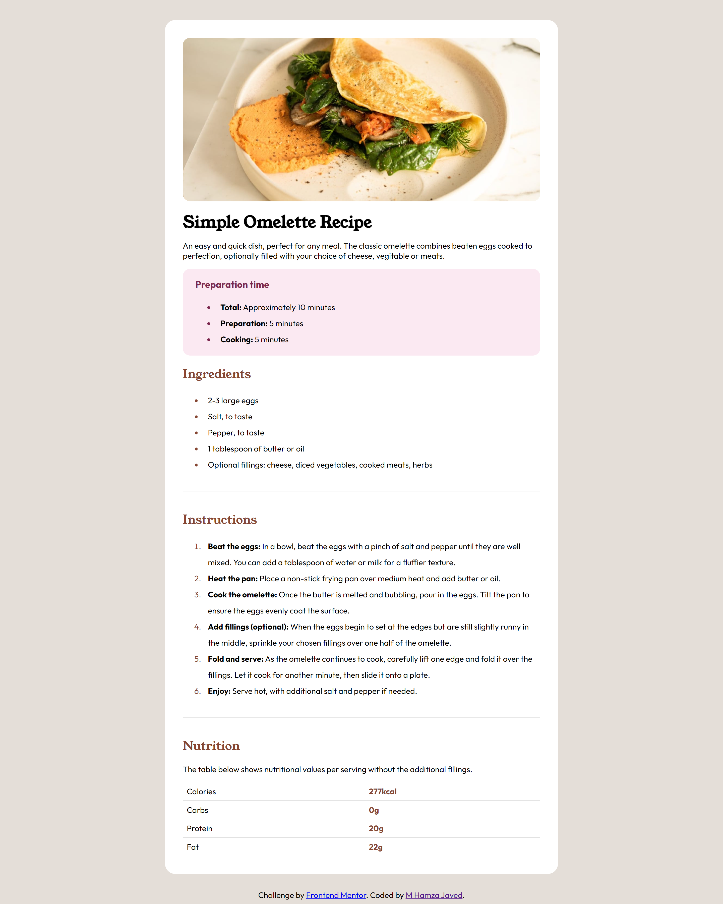

# Frontend Mentor - Recipe page solution

This is a solution to the [Recipe page challenge on Frontend Mentor](https://www.frontendmentor.io/challenges/recipe-page-KiTsR8QQKm). Frontend Mentor challenges help you improve your coding skills by building realistic projects.

## Table of contents

- [Overview](#overview)
  - [Screenshot](#screenshot)
  - [Links](#links)
- [My process](#my-process)
  - [Built with](#built-with)
  - [What I learned](#what-i-learned)
  - [Continued development](#continued-development)
  - [Useful resources](#useful-resources)
- [Author](#author)
- [Acknowledgments](#acknowledgments)

## Overview

### Screenshot

### Links

- Solution URL: [GitHub](https://github.com/codewithhamxa/frontend_mentor_recipePageChallange)
- Live Site URL: [Preview](https://codewithhamxa.github.io/frontend_mentor_recipePageChallange/)

## My process

### Built with

- Semantic HTML5 markup
- CSS custom properties
- Flexbox
- Mobile-first workflow

### What I learned

Throughout this project, I learned how to use semantic HTML5 markup effectively to create a well-structured and accessible web page. Additionally, I explored custom CSS properties to enhance the design and improve user experience.

### Continued development

In future projects, I want to focus on improving my skills in:

- Responsive design: Ensuring that web pages look great on all devices.
- Advanced CSS techniques: Utilizing CSS Grid and more complex animations.
- JavaScript: Enhancing interactivity and functionality.

### Useful resources

- [MDN Web Docs](https://developer.mozilla.org/en-US/) - An excellent resource for learning more about HTML, CSS, and JavaScript.
- [CSS-Tricks](https://css-tricks.com/) -  Great articles and tips on CSS techniques.

## Author

- Linkedin - [M. Hamza Javed](https://www.linkedin.com/in/hamzajavedreactdev/)
- Frontend Mentor - [@codewithhamxa](https://www.frontendmentor.io/profile/codewithhamxa)

## Acknowledgments

I'd like to thank Frontend Mentor for providing this challenge. It was a great learning experience and helped me improve my skills in web development.